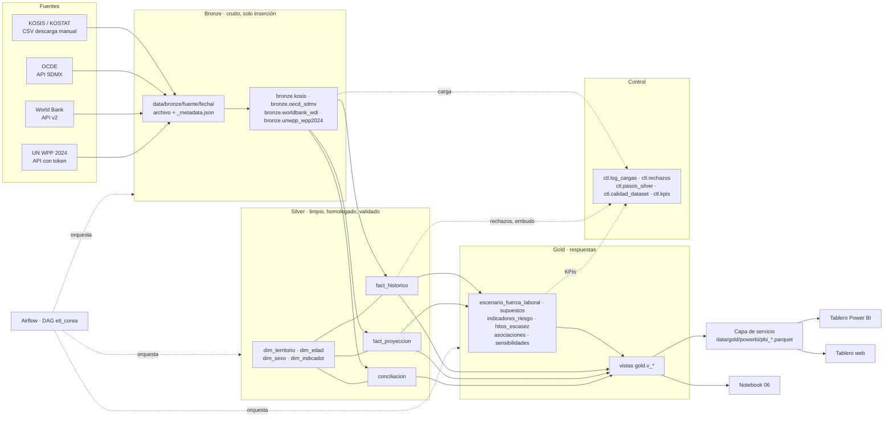
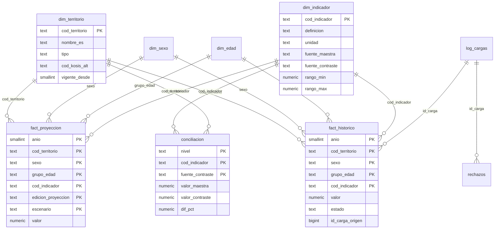

# Diseño del pipeline y del modelo de datos

Pregunta central: **¿cómo impactará la disminución de la natalidad y el envejecimiento poblacional en la
disponibilidad futura de la fuerza laboral en Corea del Sur?**

El ETL extrae, depura, integra y versiona. **No produce proyecciones**: la proyección es la oficial de KOSTAT, sin
modificar, y lo que se calcula sobre ella son escenarios propios rotulados como tales.

## 1. Arquitectura medallón

| Capa | Qué hace | Cómo se actualiza |
|---|---|---|
| Bronze | Guarda la respuesta de cada fuente tal como llega, con `fuente`, `url`, `params`, `fecha_extraccion`, `id_carga` y `hash_registro`. El archivo crudo queda en `data/bronze/<fuente>/<fecha>/` con un `_metadata.json` determinista. | Solo inserción. Si el crudo es idéntico (sha256) al de la última carga exitosa, la carga queda `omitido` y no se duplica. |
| Silver | Formato largo, códigos homologados, unidades convertidas, validaciones con rechazo trazado, agregados y derivados, conciliación. | Reconstrucción completa en una transacción desde la última carga exitosa de cada dataset: si algo falla, queda la versión anterior. |
| Gold | Escenarios propios, índice de riesgo, hitos de escasez, asociaciones, sensibilidades, vistas y la capa de servicio del tablero. | Se recalcula desde silver; respaldo en Parquet y CSV en `data/gold/<fecha>/` con `manifest.json`. |
| Control | Bitácora de cada ejecución, rechazos con motivo, embudo bronze → silver y KPIs de calidad. | Una fila por ejecución (nunca se borra). |

Orquestación: `python main.py` (bronze → silver → gold) o el DAG `etl_corea` de Airflow, que corre las cuatro
fuentes en paralelo, luego silver, gold y una verificación de KPIs (ver `airflow/README.md`).

## 2. Tres niveles de evidencia, siempre separados

| Nivel | Dónde vive | Qué contiene | `tipo_dato` en gold |
|---|---|---|---|
| Histórico observado | `silver.fact_historico` | 2000–2025, fuente maestra + derivados calculados en el pipeline | `observado` o `preliminar` |
| Proyección oficial | `silver.fact_proyeccion` | KOSTAT sin modificar: nacional 2026–2072 (8 escenarios: fecundidad, migración y envejecimiento) y si-do 2026–2052 (medio) | `proyeccion_oficial` |
| Escenario propio | `gold.escenario_fuerza_laboral` + `gold.supuestos` | Fuerza laboral potencial bajo los supuestos A, B, C y D del equipo | `escenario_propio` |

Ninguna tabla mezcla dos niveles. Las vistas que muestran histórico y proyección juntos (`v_panel_indicadores`,
`v_senales_escasez`, `v_natalidad_vs_15_64`) llevan la columna `nivel` y, en el panel, `tipo_dato`, para que un
tablero no pueda presentar una proyección como observación.

## 3. Grano y claves

Todo en formato largo: **una observación por fila**. Cuando un indicador no tiene desagregación se usa `TOTAL`
(sexo `T`, grupo de edad `TOTAL` o `15+` en la EAPS).

| Tabla | Grano | Clave primaria |
|---|---|---|
| `silver.fact_historico` | año × territorio × sexo × grupo de edad × indicador | `(anio, cod_territorio, sexo, grupo_edad, cod_indicador)` |
| `silver.fact_proyeccion` | … × edición × escenario | la anterior + `edicion_proyeccion` + `escenario` |
| `silver.conciliacion` | par maestra-contraste | `(nivel, anio, cod_territorio, sexo, grupo_edad, cod_indicador, escenario, fuente_contraste)` |
| `gold.escenario_fuerza_laboral` | año × escenario KOSTAT × supuesto × sexo × grupo EAPS | `(anio, escenario_kostat, id_supuesto, version_modelo, sexo, grupo_edad)` |
| `gold.indicadores_riesgo` | si-do | `cod_territorio` |

Metadatos por registro en silver: `fuente`, `fecha_extraccion`, `version_publicacion`, `estado`
(`preliminar`/`definitivo`), `id_carga` (la carga silver) e `id_carga_origen` (la carga bronze de donde viene).
El detalle de cada columna está en el [diccionario de datos](diccionario_datos.md).

## 4. Modelo estrella (silver)

**Dimensiones** (se cargan desde `config/mappings/*.csv`):

- `dim_territorio`: nacional (`00`), 17 si-do con su código KOSIS (y el nuevo de Gangwon y Jeonbuk), el agregado
  Chungnam + Sejong (`CNSJ`), los países de comparación (ISO3) y el promedio OCDE (`OED`).
- `dim_edad`: quinquenales 0-4 … 85+, decenales de la EAPS (15-19, 20-29 … 60+), grupos de la OCDE (15-24, 25-54,
  55-64), agregados 0-14 / 15-64 / 65+ / 15+ y `TOTAL`.
- `dim_sexo`: `T`, `H`, `M`, con su equivalencia en KOSIS, World Bank y OCDE.
- `dim_indicador`: 16 indicadores con definición, unidad, frecuencia original, fuente maestra y de contraste y
  rango válido (la validación de rangos se lee de aquí).

## 5. Transformaciones bronze → silver

1. Parsear cada crudo a formato largo (KOSIS en formato ancho o con encabezado doble; SDMX; JSON del WB y UN WPP).
2. Homologar territorio, sexo, edad, indicador y escenario contra las dimensiones con `etiquetas.csv` (incluye las
   etiquetas en coreano). Lo que no se reconoce se rechaza con motivo.
3. Convertir unidades: miles → personas en la EAPS; 85-89 … 100+ → 85+.
4. Frecuencia anual común: la EAPS entra como el promedio anual publicado; la población es la de mitad de año.
5. Validar (detalle en [03_validacion.md](03_validacion.md)) y mandar los rechazos a `ctl.rechazos`.
6. Calcular agregados de edad, Chungnam + Sejong (las tasas se recalculan desde los niveles) y los derivados:
   - proporción de 65+ = pob 65+ / pob total × 100;
   - índice de envejecimiento = pob 65+ / pob 0-14 × 100;
   - dependencia de vejez = pob 65+ / pob 15-64 × 100.
7. Conciliar maestra vs contraste y guardar la diferencia porcentual.

Cada paso registra sus filas en `ctl.pasos_silver` (embudo). Si un filtro aumentara filas, el pipeline se detiene.
Además, `ctl.calidad_dataset` guarda los registros evaluados, válidos y rechazados de cada dataset de bronze.

## 6. Capa gold

| Objeto | Pregunta | Qué responde |
|---|---|---|
| `v_panel_indicadores` | 1, 3, 4, 9 | Panel año × territorio con todos los indicadores (histórico y proyección media), con `tipo_dato` |
| `v_natalidad_vs_15_64` | 2 | Nacidos de cada año frente a quienes entran a 15-19 quince años después |
| `indicadores_riesgo`, `riesgo_sensibilidad` | 5 | Índice de riesgo por si-do y su robustez |
| `v_proyeccion_escenarios` | 6a | Población 15-64 y dependencia en los 8 escenarios de KOSTAT |
| `escenario_fuerza_laboral`, `supuestos`, `v_escenarios_resumen`, `escenarios_sensibilidad` | 6b | Fuerza laboral potencial bajo A/B/C/D y su sensibilidad |
| `asociaciones` | 7 | Correlaciones en niveles y en variaciones (asociación, no causalidad) |
| `hitos_escasez`, `v_senales_escasez` | 8 | Años en que se cruzan umbrales; relevo generacional y reemplazo laboral |
| `v_kpis_calidad`, `v_embudo_silver`, `v_conciliacion` | — | Calidad del pipeline |

La pregunta 10 (información para política pública) se responde en el informe combinando las tres capas.

### Escenarios propios de fuerza laboral (6b)

`fuerza laboral (año, sexo, grupo) = población KOSTAT × factor de cobertura × tasa de participación / 100`

- **Factor de cobertura:** población 15+ de la EAPS / población KOSTAT del mismo sexo y grupo en 2025. La EAPS no
  cubre militares ni población institucional; con el factor, el año base reproduce la población activa observada.
- **A · constante:** cada tasa por sexo y grupo queda en su valor de 2025.
- **B · tendencia con tope:** tendencia lineal 2015–2025, cambio máximo ±15 puntos, entre 0 y 90 %, congelada desde 2050.
- **C · convergencia OCDE:** cada tasa converge linealmente al promedio OCDE de su sexo y edad hasta 2050 (15-19 y
  60+ constantes: la OCDE no publica edades equivalentes).
- **D · cierre de brecha de género:** las mujeres cierran linealmente la mitad de su brecha de participación con
  los hombres hasta 2050; los hombres quedan como en A. Donde las mujeres ya participan más (15-29), su tasa no cambia.

Cada escenario se calcula sobre los tres escenarios de fecundidad de KOSTAT y se guarda con `id_supuesto` y
`version_modelo` (hoy `v2`). Los parámetros están en `config.yaml` (sección `gold`) y su justificación y
sensibilidad en el README ("Supuestos del modelo").

### Índice de riesgo demográfico por si-do (5)

Cuatro componentes con igual peso, normalizados 0–100 entre los 17 si-do (100 = más riesgo): proporción de 65+ y
TFR en 2025; variación de la población 15-64 y dependencia de vejez proyectadas a 2052 (KOSTAT, medio). Es
descriptivo, no causal. `riesgo_sensibilidad` lo recalcula con otros 6 esquemas: otros pesos, normalización por
percentiles y una variante de 6 componentes estandarizados (z-score) que agrega participación y reemplazo laboral.

## 7. Decisiones de diseño

| Decisión | Motivo |
|---|---|
| Una fuente maestra por indicador; el contraste solo se concilia | Evitar mezclar definiciones distintas del mismo indicador |
| Derivados calculados en el pipeline, no tomados de la fuente | Una sola fórmula para todos los territorios y años |
| Frecuencia anual común | Las preguntas son de largo plazo; la EAPS publica el promedio anual oficial |
| PostgreSQL con PK y FK | La unicidad y la integridad referencial las garantiza la base, no solo el código |
| Silver reconstruido completo en una transacción | Idempotencia: la misma entrada da siempre la misma salida |
| Bronze solo inserción con sha256 | Trazabilidad hasta el archivo crudo y sin duplicados entre cargas |
| Catálogo y reglas en `config.yaml` y `config/mappings/` | Agregar una fuente o cambiar un umbral no requiere código |
| Respaldo en Parquet/CSV de silver y gold | Analizar sin la base |
| Capa de servicio del tablero en Python | Power BI y la versión web leen tablas ya preparadas; ninguna transformación queda escondida en Power Query |
