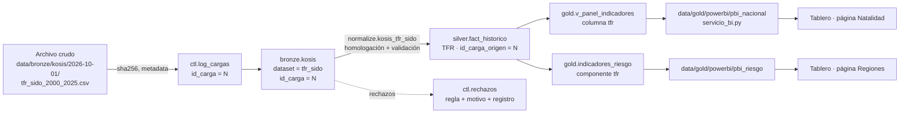

# Linaje de los datos

Cada valor que se ve en un tablero se puede rastrear hasta el archivo crudo del que salió, por dos caminos:

- **Por registro:** toda fila de silver guarda `id_carga_origen` → `ctl.log_cargas` (dataset, archivo, sha256,
  fecha, método) → archivo en `data/bronze/<fuente>/<fecha>/` y su `_metadata.json` (URL, parámetros, cobertura).
- **Por indicador:** las tablas de este documento dicen qué tabla de origen, qué función de transformación y qué
  objeto gold intervienen en cada indicador.



## Del origen a silver

| Indicador (`cod_indicador`) | Fuente y tabla de origen | Dataset bronze | Transformación (`src/transform/silver/normalize.py`) | Tabla silver |
|---|---|---|---|---|
| NACIMIENTOS, DEFUNCIONES, CRECIMIENTO_NATURAL | KOSIS DT_1B8000G | `vitales_sido` | `kosis_vitales_sido`: ítems del archivo → indicador, nacional + 17 si-do | `fact_historico` |
| ESPERANZA_VIDA | KOSIS DT_1B8000F | `vitales_nacional` | `kosis_vitales_nacional`: ítems por sexo → T/H/M | `fact_historico` |
| TFR | KOSIS DT_1B81A17 | `tfr_sido` | `kosis_tfr_sido`: nacional + 17 si-do | `fact_historico` |
| POB_15MAS, POB_ACTIVA, OCUPADOS, TASA_PARTICIPACION, TASA_DESEMPLEO (si-do) | KOSIS DT_1DA7004S | `eaps_sido` | `kosis_eaps_sido`: 17 si-do (el nacional sale de la tabla por sexo y edad), miles → personas | `fact_historico` |
| Los mismos, por sexo y edad (nacional) | KOSIS DT_1DA7012S | `eaps_sexo_edad` | `kosis_eaps_sexo_edad`: grupos decenales, miles → personas | `fact_historico` |
| POBLACION 2000–2025 (nacional) | KOSIS DT_1BPA001 | `poblacion_nacional` | `kosis_poblacion_nacional`: 85-89 … 100+ → 85+ | `fact_historico` (2023–2025 `preliminar`) |
| POBLACION 2026–2072 (nacional, medio) | KOSIS DT_1BPA001 | `poblacion_nacional` | ídem | `fact_proyeccion` (`KOSTAT_2022_2072`) |
| POBLACION 2026–2072 (fecundidad alta/baja, migración) | KOSIS, tabla por escenario | `proyeccion_escenarios` | `kosis_proyeccion_escenarios`: etiquetas coreanas → `alto`, `bajo`, `migracion_*`, `sin_migracion` | `fact_proyeccion` |
| POBLACION por si-do | KOSIS DT_1BPB001 | `poblacion_sido` | `kosis_poblacion_sido` | `fact_historico` hasta 2025; `fact_proyeccion` (`KOSTAT_2022_2052`) desde 2026 |
| PIB_HORA | OCDE `DSD_PDB@DF_PDB` | `productividad` | `oecd_productividad` | `fact_historico` |
| TASA_PARTICIPACION por sexo y edad, promedio OCDE | OCDE `DSD_LFS@DF_IALFS_LF_WAP_Q` | `participacion_edad_sexo` | `oecd_participacion`: solo el promedio OCDE (Corea sale de la EAPS) | `fact_historico` (territorio `OED`, usado en el supuesto C) |
| Indicadores de comparación internacional | World Bank WDI | `SP.*`, `SL.*` | `worldbank`: Corea solo si el WB es la maestra (PIB por ocupado); si no, va a conciliación | `fact_historico` (países ISO3) |
| PROP_65MAS, INDICE_ENVEJECIMIENTO, DEPENDENCIA_VEJEZ | Calculados | — | `src/transform/silver/derive.py` desde POBLACION 0-14 / 15-64 / 65+ | `fact_historico` y `fact_proyeccion` (`fuente = PIPELINE`) |
| Contrastes (OECD, WB, UN WPP) | OCDE, WB, UN WPP | varios | `src/transform/silver/reconcile.py` | `conciliacion` (nunca reemplaza el valor maestro) |

## De silver a gold y a los tableros

| Objeto gold | Lee de | Pregunta | Página del tablero (tabla de servicio) |
|---|---|---|---|
| `v_panel_indicadores` | `fact_historico`, `fact_proyeccion` (medio) | 1, 3, 4, 9 | Natalidad, Envejecimiento, Corea vs OCDE (`pbi_nacional`, `pbi_regional`, `pbi_internacional`) |
| `v_natalidad_vs_15_64`, `fact_proyeccion` | NACIMIENTOS y POBLACION | 2 | Envejecimiento (`pbi_piramide`) |
| `indicadores_riesgo`, `riesgo_sensibilidad` | `fact_historico` 2025 + `fact_proyeccion` si-do 2052 | 5 | Regiones (`pbi_riesgo`, `pbi_territorio`) |
| `v_proyeccion_escenarios` / `fact_proyeccion` | proyección nacional en los 8 escenarios | 6a | Fuerza laboral (`pbi_escenarios`) |
| `escenario_fuerza_laboral`, `supuestos`, `v_escenarios_resumen` | `fact_proyeccion` + EAPS por sexo y edad + OCDE `OED` | 6b | Fuerza laboral (`pbi_flp`, `pbi_escenario_sel`) |
| `asociaciones` | `fact_historico` nacional | 7 | Corea vs OCDE (PIB por hora) |
| `hitos_escasez`, `v_senales_escasez` | `fact_historico`, `fact_proyeccion`, `escenario_fuerza_laboral` | 8 | Fuerza laboral (reemplazo laboral) y Resumen (`pbi_kpi`) |
| `v_kpis_calidad`, `v_calidad_dataset`, `v_conciliacion` | `ctl.kpis`, `ctl.calidad_dataset`, `silver.conciliacion` | — | Calidad y OKR (`pbi_okr`, `pbi_calidad`, `pbi_conciliacion`) |

La capa de servicio `data/gold/powerbi/pbi_*.parquet` (`src/transform/gold/servicio_bi.py`) se escribe al final de la
capa gold; el tablero de Power BI y su versión web solo leen esos archivos.

Los mismos objetos se exportan a `data/gold/<fecha>/` (Parquet y CSV, con `manifest.json` que guarda filas,
columnas, sha256 e `id_carga`). De ahí lee el notebook `06_resultados_gold.ipynb`.

## Cómo rastrear un valor

```sql
-- ¿De qué archivo viene la TFR nacional de 2024?
SELECT f.valor, f.fuente, f.estado, l.dataset, l.archivo, l.hash_archivo, l.inicio
FROM silver.fact_historico f
JOIN ctl.log_cargas l ON l.id_carga = f.id_carga_origen
WHERE f.cod_indicador = 'TFR' AND f.cod_territorio = '00' AND f.anio = 2024 AND f.sexo = 'T';

-- ¿Qué se rechazó de la EAPS por si-do en la última carga silver, y por qué?
SELECT regla, motivo, registro FROM ctl.rechazos
WHERE id_carga = (SELECT max(id_carga) FROM ctl.log_cargas WHERE dataset = 'silver.fact_historico')
  AND registro->>'dataset' = 'eaps_sido';
```

El `_metadata.json` junto al archivo crudo completa el linaje hacia la fuente: URL de la tabla en KOSIS (o de la
consulta a la API), parámetros, encoding, cobertura de años detectada y avisos.
